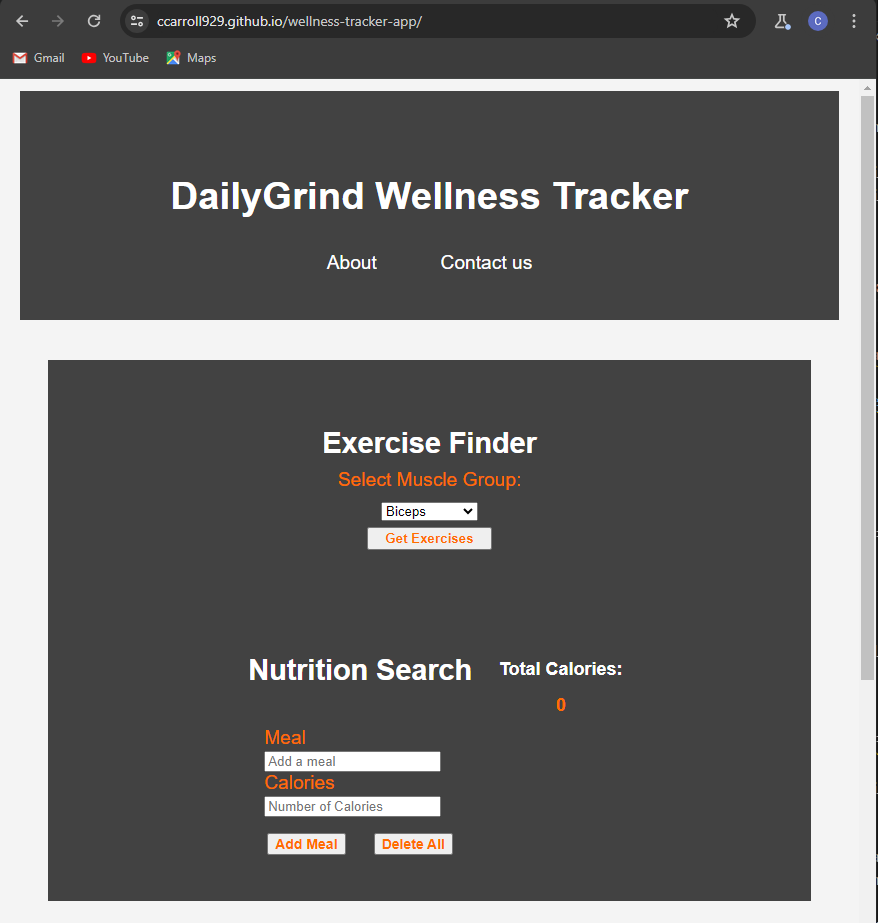
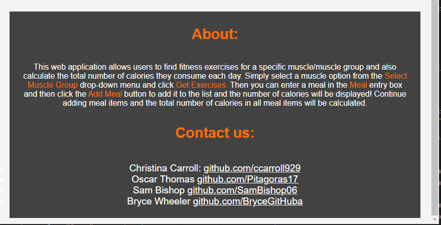

# DailyGrind Wellness Tracker

###  Project Description: 
This web application is designed to help wellness-oriented users to find exercises by searching for a muscle or muscle group and also keep track of their daily calorie intake with a calorie calculator. It utilizes two server-side API databases, API Ninjas and Calorie Ninjas, to provide users with the data for exercises and calorie intake. 

### [Deployed application link (click here)](https://ccarroll929.github.io/wellness-tracker-app/) 

###   
### 

### User Story:

- As a user who prioritizes personal fitness,
- I want to find exercises for specific muscle groups,
- So that I can achieve an effective workout

- As a user who prioritizes personal wellness, 
- I want to keep track of my calorie intake
- So that I can reach my personal wellness goals

### Acceptance Criteria:
- GIVEN I am a user searching for effective exercises,
- WHEN I select a muscle option from the drop-down menu,
- THEN the application returns exercises that target that muscle/muscle group  
  
- GIVEN I am a user watching their calorie intake, 
- WHEN I enter the meals I have eaten today and click the "Add Meal" button, 
- THEN the application returns the number of calories in that meal item and saves item to local storage  
 
- GIVEN I enter an additional meal item,
- WHEN I click the "Add Meal" button,
- THEN it is added to the meal list and the total calories of all items in the list is calculated 

### User Flow Diagram: 
- User enters muscle or muscle group → returns exercises that target the muscle group  

- User enters meal item → returns number of calories in meal item  

- User enters additional meal item → calculates total calories of all meal items  

### Server Side APIs:
- [Calorie Ninjas API](https://calorieninjas.com/api)
- [API Ninjas](https://api-ninjas.com/) 

### CSS Framework:
- [Assembler CSS](https://asmcss.com/)  
